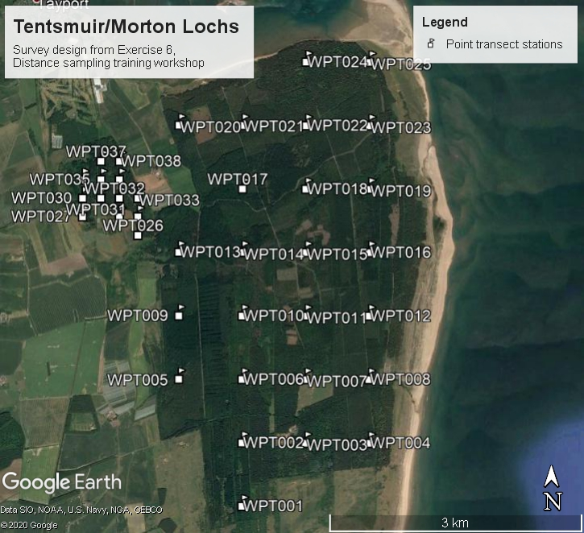

```{r, include=FALSE, message=FALSE}
knitr::opts_chunk$set(echo = TRUE)
```

# Introduction

We provide two exercises in survey design so you can choose the one you feel is most useful to you. 

- The first example involves designing a line transect survey to estimate the abundance of porpoise, common dolphins and seals in and around St Andrews Bay. 
  - It considers how you choose your design based on effort limitations. 
  - It also compares an aerial survey based on systematic parallel lines with a boat based survey using zigzags. 
- The [second example](#point-transect-bird-survey-in-tentsmuir-forest) involves designing a point transect bird survey in Tentsmuir Forest. 
  - This looks at how to project your study area from latitude and longitude on to a flat plane using R. 
  - It also involves defining a design for multiple strata with different coverage in each strata. 

# Systematic parallel line aerial survey of marine mammals in St Andrews bay

**The objective of this exercise is to decide on a systematic line spacing which uses as much of the 250 km of available effort as possible without risking not being able to complete the survey. We must remember that some of the 250 km will be spent travelling off-effort between transects.**

This project involves designing an aerial survey of porpoise, common dolphins and seals in and around St Andrews bay. (For locals: the nearer St Andrews bay region has been extended in an easterly direction out past Bell Rock, as there are some pockets of deeper water that are of interest with regard to the distribution of cetaceans. The survey region has a chunk missing due to a no-fly zone around Buddon Ness, just south of Carnoustie because of the Royal Marines base there).

This uses the package `leaflet` to  give you a better image of the portion of the North Sea where the aerial survey for marine mammals was proposed, here is a quick figure, showing the Kingdom of Fife extending eastward from the coast of Scotland into the North Sea.

```{r standbay, echo=FALSE, fig.height=5, fig.width=6, fig.cap="St Andrews Bay lies northeast of St Andrews.", message=FALSE, warning=FALSE}
library(rgdal)
library(leaflet)
starea <- readOGR("nicerarea.shp", layer="nicerarea", 
               GDAL1_integer64_policy = TRUE, verbose=FALSE)

sab <- leaflet() %>% addProviderTiles(providers$Esri.OceanBasemap)
sab <- sab %>% 
  setView(-2.5, 56.41, zoom=10) %>%
  addPolygons(data=starea)
sab <- addMarkers(sab,
                  lng = c(-2.7967, -2.7375, -2.6036), lat = c(56.3398, 56.4661, 56.2697),
                  label = c("St Andrews", "Buddon Ness", "Fife Ness airstrip"),
                  labelOptions = labelOptions(noHide = T, textOnly = TRUE))
sab
```

Before we begin we must load the distance sampling survey design R library. 

```{r loadlib}
library(dssd)
```

## Study Region

First of all we will set up the study region and plot it. The shapefile for this study area is contained within the `dssd` R library. This shapefile has already been projected from latitude and longitude on to a flat plane and its units are in metres. The first line of code below returns the path for the shapefile within the R library and may vary on different computers. You will then pass this shapefile pathway to the *make.region* function to set up the survey region. As this shapefile does not have a projection (.prj) file associated with it we should tell `dssd` the units (m) when we create the survey region.

```{r region, fig.align='center', fig.cap="Study Region", fig.width=4, fig.height=4.5}
#Find the pathway to the file
shapefile.name <- system.file("extdata", "StAndrew.shp", package = "dssd")
#Create the region using this shapefile
region <- make.region(region.name = "St Andrews Bay",
                      units = "m",
                      shape = shapefile.name)
#Plot the region
plot(region)
```

## Coverage

The next step is to set up a coverage grid. A coverage grid is a grid of regularly spaced points and is used to assess whether each point in the survey region is equally likely to sampled. The coverage grid needs to be created before the coverage simulation is run. 

```{r coveragegrid}
# Set up coverage grid
cover <- make.coverage(region, n.grid.points = 500)
```

## Systematic Parallel Design

The small survey plane available can complete a total flight time of around 250 km (excluding the flight time to and from the landing strip at Fife Ness). Generally, systematic parallel line designs are preferable for aerial surveys as they allow some rest time for observers as the plane travels between transects and avoids the sharp turns associated with zigzag designs.

Firstly, we will consider the design angle. Often animal density is affected by distance to coast so it is probably wise for this survey to orientate lines approximately perpendicular to the coast. To do this we can select a design angle of 90 degrees. We can therefore expect to spend a little more than 40 km (the height of the survey region) on off-effort transit time and might hope to be able to complete around 200 km of transects. `dssd` lets us specify the desired line length as a design parameter and will then choose an appropriate value for transect spacing. We will choose a minus sampling strategy and set the truncation distance to 2 km. Note that as our survey region coordinates are in metres we also need to supply the design parameters in metres. 

```{r design}
# Define the design
design.LL200 <- make.design(region = region,
                      transect.type = "line",
                      design = "systematic",
                      line.length = 200000,
                      design.angle = 90,
                      edge.protocol = "minus",
                      truncation = 2000,
                      coverage.grid = cover)

```

Now we have defined the design we should check it visually by creating a survey (a single set of transects).

```{r setseed, echo = FALSE}
# I set a seed so that my figures matched the txt you shouldn't run this!
set.seed(263)
```

```{r survey, fig.cap="Single survey generated from the systematic parallel line design", fig.width=4, fig.height=4.5, fig.pos='[!h]'}
# Create a single survey from the design
survey.LL200 <- generate.transects(design.LL200)
# Plot the region and the survey
plot(region, survey.LL200)
```

We can see that the survey consists of parallel systematically spaced transects running horizontally across the survey region roughly perpendicular to the coast as we wanted. We can also view the details of the survey which will tell us what spacing `dssd` used to try and achieve a line length of 200 km.

```{r surveydetails}
# Display the survey details
survey.LL200
```

We can see that the spacing used by `dssd` was 4937.5 m which gives us 8 samplers and a coverage of just under 80%. In addition, this example survey has a line length of just under 200 km and a trackline length of just over 248 km. However, given the random nature of the design and the fact that the width of the study region is not constant everybody should get slightly different values. Although my trackline length was just under 250 km  it is not sufficient to only look at one survey, we need to know that all surveys under this design will have a trackline length of < 250 km.

To assess the design statistics across many surveys we will now run a coverage simulation. This simulation will randomly generate many surveys from our design and record coverage as well as various statistics including line length and trackline length. As we know that coverage for a parallel line design is largely uniform (apart from edge effects due to minus sampling) we do not need to run too many repetitions, 100 should be sufficient to give us an indication of the range of line lengths and trackline lengths for this design.

```{r runcoverage, eval=FALSE}
# Run the coverage simulation
design.LL200 <- run.coverage(design.LL200, reps = 100)
design.LL200
```

After you have run the coverage simulation take a look at the design statistics. The mean line length should be around 200 km (200,000 m). Now look at the maximum trackline length, we need this value to be less than 250 km (250,000 m). 

Use the results of this simulation to create some new designs based on various spacings to find the maximum line length that can be achieved without risking exceeding the maximum trackline length of 250 km (remember to generate a line length of 200 km `dssd` selected a spacing of 4938m). Maybe try spacings of 5000 m or 5500 m.

```{r designspacing, eval=FALSE}
# Define the design
design.space500 <- make.design(region = region,
                      transect.type = "line",
                      design = "systematic",
                      spacing = 5000,
                      design.angle = 90,
                      edge.protocol = "minus",
                      truncation = 2000,
                      coverage.grid = cover)
```


<ul style="color:blue; font-size:100%">
<li>What spacing would you select for this design? 
<li>What is the maximum trackline length for the design you have selected? 
<li>What on-effort line length are we likely to achieve?
</ul>

## Zigzag Design

Zigzag designs are often more efficient in their use of effort having less off-effort transit time between transects. For this survey another option would be to complete a boat-based survey. The boat survey will have the same total effort available allowing us a trackline length of 250 km.

Let us now define a zigzag design for the same region. For zigzag designs the design angle has a different definition, it describes the angle across which the zigzags are constructed. For this example we want a vertical design angle so we will set it to 0. Zigzag designs also require an additional argument as zigzags can only be created inside convex shapes. We therefore need to specify the bounding shape, here we will choose a convex hull as it is more efficient than a minimum bounding rectangle. A convex hull works as if we were stretching an elastic band around the survey region. The code below shows you how to create the zigzag design, you should then create a single realisation of this design and plot it to check it looks acceptable.

```{r zzdesign, eval=TRUE, fig.cap="Single survey generated from the equal spaced zigzag design", fig.width=4, fig.height=4.5}
# Define the zigzag design
design.zz.4500 <- make.design(region = region,
                      transect.type = "line",
                      design = "eszigzag",
                      spacing = 4500,
                      design.angle = 0,
                      edge.protocol = "minus",
                      bounding.shape = "convex.hull",
                      truncation = 2000,
                      coverage.grid = cover)

survey.zz <- generate.transects(design.zz.4500)
plot(region, survey.zz)
```

Next we will run a coverage simulation to verify that we have stayed within the restraints of our survey effort; a total trackline length of < 250 km. This time when we run the coverage simulation we will ask it to complete more repetitions so we can also assess the coverage. 

First we can output the design statistics. 
<ul style="color:blue; font-size:100%">
<li>Does this design meet our survey effort constraint? 
<li>What is the maximum total trackline length for this design? 
<li>What line length are we likely to achieve with this design? 
<li>Is this higher or lower than the systematic parallel design?
</ul>

```{r zzcoverage, eval = FALSE}
# Run the coverage simulation
design.zz.4500 <- run.coverage(design.zz.4500, reps = 500)
# Display the design statistics
design.zz.4500
```

Next we can check the coverage. Sometimes with zigzag surveys generated inside convex hulls we can get areas of higher coverage in narrower parts of the survey region at either end of the design axis. One of the easiest ways to assess coverage is visually by plotting the coverage grid.

```{r zzcoverageplot, eval = FALSE}
# Plot the coverage grid
plot(design.zz.4500)
```


<ul style="color:blue; font-size:100%">
<li>Do you think the coverage scores look uniform across the study region? 
<li>Where are they higher/lower?
<li>Why do you think this is?
  <ul style="color:blue; font-size:100%">
  <li>Note, you can go back to one of your parallel line designs and plot the coverage scores to compare (although there are fewer repetitions you can still get an idea of coverage).
  </ul>
</ul>
***
***

# Point Transect Bird Survey in Tentsmuir Forest

**The objective of this exercise is to design a point transect survey looking at songbird abundance in Tentsmuir Forest so that separate estimates of abundance can be obtained for the two strata.**

Tenstsmuir Forest is a mature pine forest located on the east coast of Scotland and is a 20 minute drive north of St Andrews. The western area of Tentsmuir around Morton Lochs is of special interest in this study as this part of the forest forms part of the Tentsmuir National Nature Reserve. This study region has therefore been divided into two stratum, the first is the main part of the forest and the second is the area of forest adjacent to Morton Lochs.

Before we begin we must load the distance sampling survey design R library and also the spatial library *sf*. The *sf* library needs to be loaded in this example as we need to project the survey region.

```{r loadlib2}
library(dssd)
library(sf)
```

## Projecting your Study Region

This exercise demonstrates how to deal with unprojected shapefiles. Study areas should always be projected onto a flat plane before you use them to design your survey. This is because in most parts of the world one degree latitude is not the same in distance as one degree longitude. If we didn't project, our study region and any surveys generated in it, would be distorted possibly leading to non-uniform coverage.

We will now load the study region and project it onto a flat plane using an Albers Equal Area Conical projection. As we have to project the shapefile we load the shape object separately instead of directly into a region object.

```{r loadshapefile}
#Load the unprojected shapefile
shapefile.name <- system.file("extdata", "TentsmuirUnproj.shp", package = "dssd")
sf.shape <- read_sf(shapefile.name)
# Check current coordinate reference system
st_crs(sf.shape)
# Define a European Albers Equal Area projection
proj4string <- "+proj=aea +lat_1=56 +lat_2=62 +lat_0=50 +lon_0=-3 +x_0=0 
                +y_0=0 +ellps=intl +units=m"
# Project the study area on to a flat plane
projected.shape <- st_transform(sf.shape, crs = proj4string)
```

We can now create the region object for `dssd` using the projected shape and plot it to check what it looks like. 

```{r makeregion, fig.cap="Tentsmuir Forest: showing the main stratum and the Morton Loch stratum.", fig.width=6, fig.height=5}
# Create the survey region in dssd
region.tm <- make.region(region.name = "Tentsmuir",
                         strata.name = c("Main Area", "Morton Lochs"),
                         shape = projected.shape)
# Plot the survey region
plot(region.tm)
```

## Coverage

The next step is to set up a coverage grid. A coverage grid is a grid of regularly spaced points and is used to assess whether each point in the survey region is equally likely to sampled. The coverage grid needs to be created before the coverage simulation is run. 

```{r coveragegridtm}
# Set up coverage grid
cover.tm <- make.coverage(region.tm, n.grid.points = 1000)
```

## Design

You are now going to set up a systematic point transect design. We will assume that we have sufficient resources to survey 40 point transects. As the Morton Lochs stratum is of special interest we will give it higher coverage. We will therefore explicitly allocate 25 samplers to the main stratum and 15 to the Morton Lochs stratum (note that the area of the Morton Lochs stratum is much small than the main stratum). If we wanted to allocate the same effort to both stratum we could provide the samplers argument with the single value of 40 and it would divide the effort equally between the strata. We will leave the design angle as 0 and set the truncation distance to 100 m. We will use a minus sampling approach at the edges.

<ul style="color:blue; font-size:100%">
  <li>What are the analysis implications of a design with unequal coverage?
</ul>

```{r pointdesign, eval = TRUE}
# Set up a multi strata systematic point transect design
design.tm <- make.design(region = region.tm,
                         transect.type = "point",
                         design = "systematic",
                         samplers = c(25,15),
                         design.angle = 0,
                         edge.protocol = "minus",
                         truncation = 100,
                         coverage.grid = cover.tm)
```

## Generate a Survey

You will now generate a single survey from this design and plot it inside the survey region to check what it looks like. If you want to check whether the covered areas of the samplers in the Morton Lochs stratum overlap add the argument *'covered.area = TRUE'* to the plot function.

```{r surveytm, fig.cap="Single survey generated from the systematic parallel line design", fig.width=4, fig.height=4.5}
# Create a single survey from the design
survey.tm <- generate.transects(design.tm)
# Plot the region and the survey
plot(region.tm, survey.tm, covered.area = TRUE)
```

Now look at the survey information. 

<ul style="color:blue; font-size:100%">
  <li>What spacing was used in each strata to try and achieve the desired number of samplers? 
  <li>Did your survey achieve exactly the number of samplers you requested? 
  <li>How much does coverage differ between the two strata for this realisation?
</ul>

```{r surveyinfo, results = 'hide'}
# Display survey information
survey.tm
```

### Save coordinates to a file

If this survey is to be conducted in the field, you will want the coordinates that you can load into a handheld GPS.  The function `write.transects()` can write waypoints of the survey (in this case the point transect stations) to text, comma-separated value or GPX files.

```{r, warning=FALSE}
write.transects(survey.tm,
                dsn = "tentsmuir-points.gpx",
                layer = "points",
                dataset.options = "GPX_USE_EXTENSIONS=yes",
                proj4string=sf::st_crs(sf.shape))
```

The GPX file can be transferred to a GPS, or viewed using Google Earth.

```{r, out.width="60%", echo=FALSE, fig.cap="Realised survey with locations written to GPX file and imported into Google Earth."}

```


## Assessing Coverage and Design Statistics

We will now run a coverage simulation to assess how much the number of samplers and average coverage varies between surveys. We will also be able to assess how coverage varies spatially to see if edge effects are of concern.

View the design statistics, then answer these questions. 
<ul style="color:blue; font-size:100%">
  <li>What is the minimum number of samplers you will achieve in each strata? 
  <li>Is this sufficient to complete separate analyses in each stratum?
</ul>

Next plot the coverage scores. 
<ul style="color:blue; font-size:100%">
  <li>Does it appear that there is even coverage within each strata?
  <ul style="color:blue; font-size:100%">
    <li>As there is such a difference in the range of coverage scores between strata you may need to plot each strata individually.
  </ul>
</ul>

```{r coveragetm, eval = TRUE, include=FALSE}
# Run coverage simulation
design.tm <- run.coverage(design.tm, reps = 100)

```

```{r coveragetmdisplay}
# View the design statistics
design.tm
# Plot the coverage scores
plot(design.tm)
# Plot coverage scores for individual strata
# plot(design.tm, strata.id = 1)
# plot(design.tm, strata.id = 2)
```

